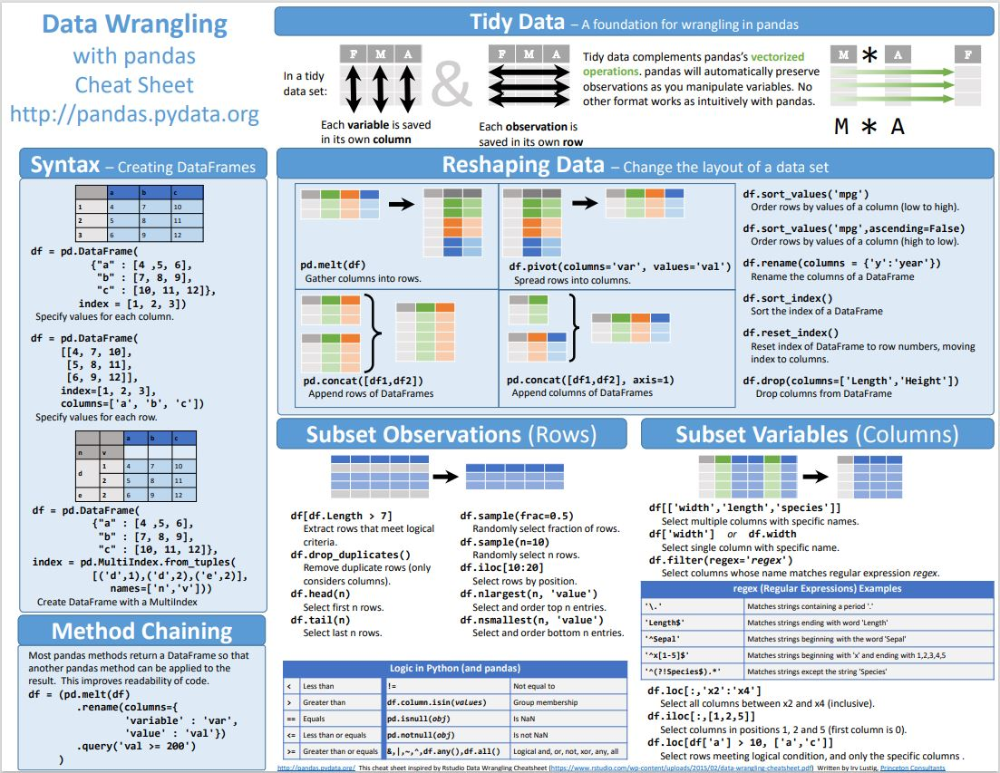
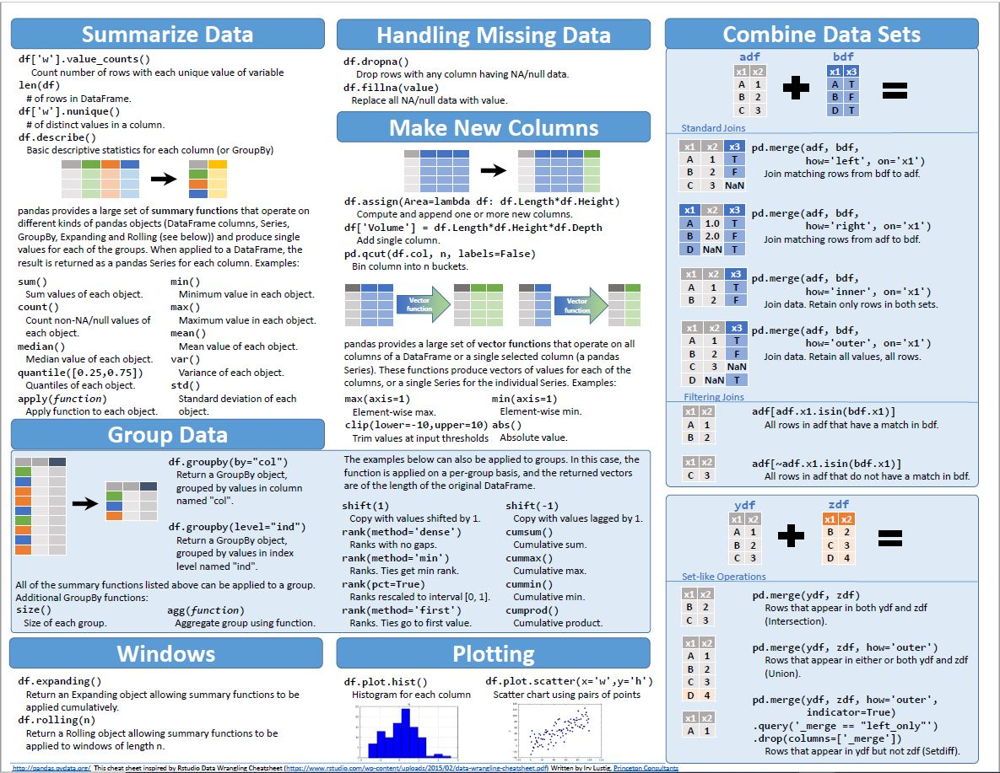

# python_cheatsheet

## instruction
- [ ] review
- [ ] research
- [ ] add
- [ ] produce
- [ ] share

## Basic Python

### Ettiquette

## Getting Data

## Transforming

### Data Wrangling

 [Data Wrangling Cheat Sheet](https://buff.ly/2qI6OWS )
 

## xploring Data

## Graphics

## Output data

## Anaconda/Conda

## Git

## markdown

[https://www.markdownguide.org/](https://www.markdownguide.org/)

[https://www.markdownguide.org/cheat-sheet/](https://www.markdownguide.org/cheat-sheet/)

## Statistics

## Machine learning

## VIM
